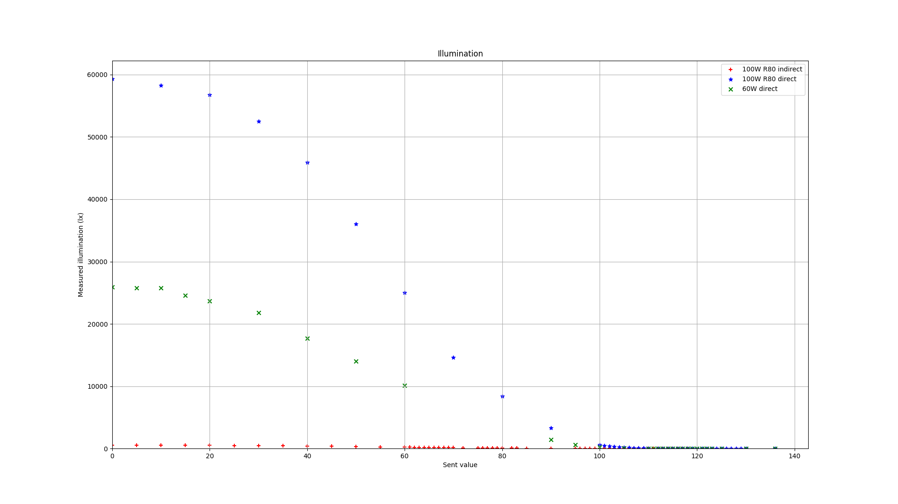
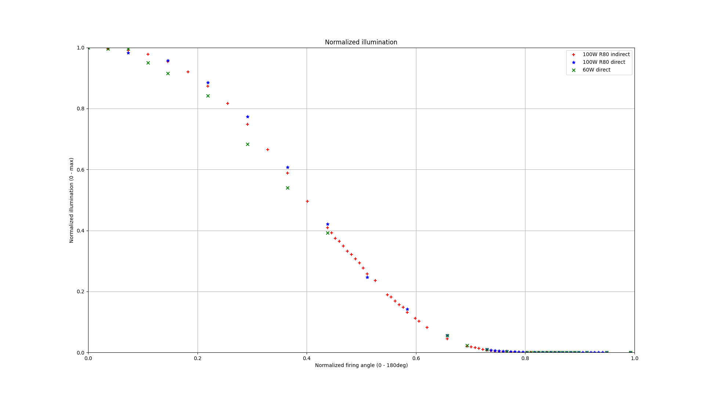
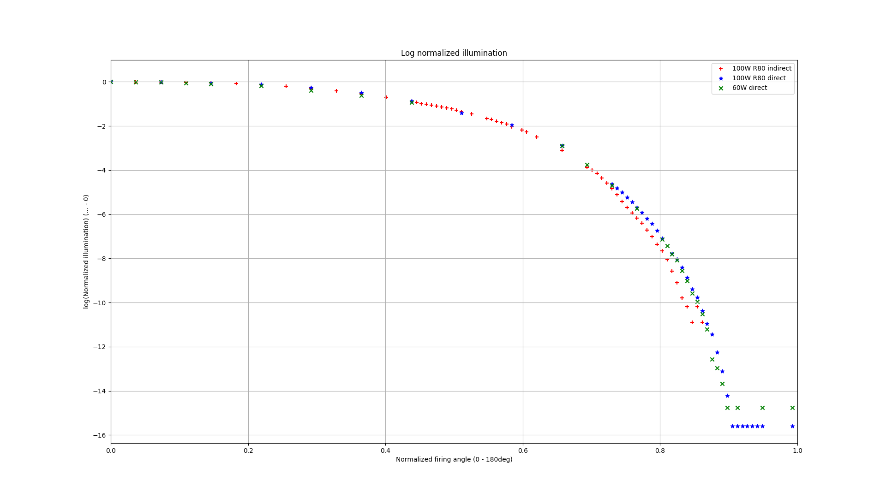
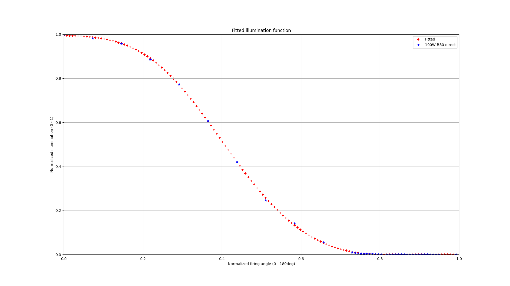
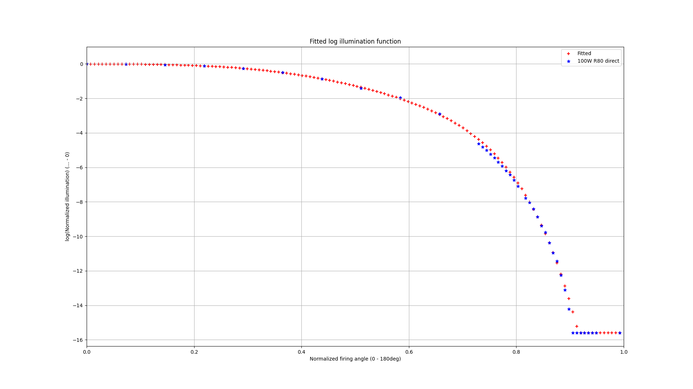
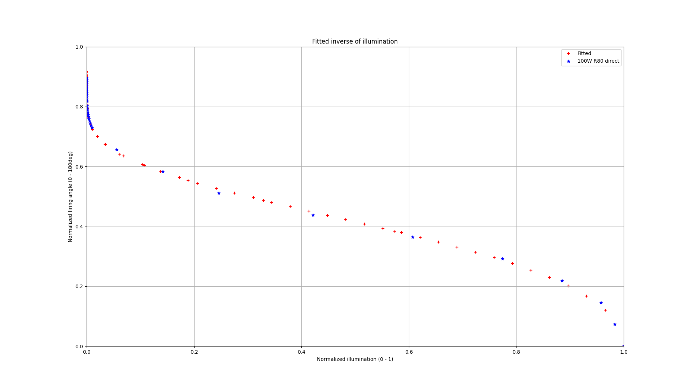
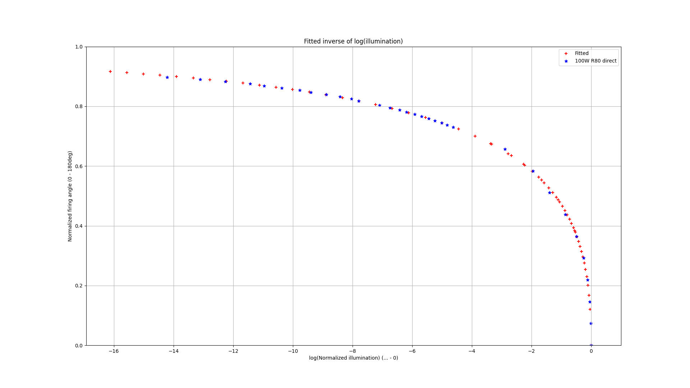

Incandescent lightbulb response curves
======================================


Phase splitting settings
------------------------

As of the state of 2024-03 settings

 - sent value `0`: fire immediately after ZC
 - sent value `137`: fire before ZC (around 180 degrees)
 - sent value `138`: fire around ZC, before/after depending on PLL state


Low power response
------------------

 - sent value `125`: glowing of 100W filament is noticable
 - sent value `124`: glowing of 60W and 100W filaments are noticable
 - sent value `123`: glowing is obvious
 - sent value `122`: 100W R80 - red glow in the reflection is obvious


Request example
---------------

```
curl -X POST http://localhost:3000/api/sendToAll?data=120
```

Measured data
-------------

See `data-1.md`, `data-2.md`, `data-3.md`. Plots from `plot-data.py`:








Fit measured data
-----------------

See `fit-response.py`. Output:

```
Fitted parameters: [-5.71971771e-03 -1.20978138e+00 -2.49947504e+01  5.21195391e+01
 -5.61237249e+01  0.00000000e+00  0.00000000e+00]

Fitted function:
[0.         0.00729927 0.01459854 0.02189781 0.02919708 0.03649635
 0.04379562 0.05109489 0.05839416 0.06569343 0.0729927  0.08029197
 0.08759124 0.09489051 0.10218978 0.10948905 0.11678832 0.12408759
 0.13138686 0.13868613 0.1459854  0.15328467 0.16058394 0.16788321
 0.17518248 0.18248175 0.18978102 0.19708029 0.20437956 0.21167883
 0.2189781  0.22627737 0.23357664 0.24087591 0.24817518 0.25547445
 0.26277372 0.27007299 0.27737226 0.28467153 0.2919708  0.29927007
 0.30656934 0.31386861 0.32116788 0.32846715 0.33576642 0.34306569
 0.35036496 0.35766423 0.3649635  0.37226277 0.37956204 0.38686131
 0.39416058 0.40145985 0.40875912 0.41605839 0.42335766 0.43065693
 0.4379562  0.44525547 0.45255474 0.45985401 0.46715328 0.47445255
 0.48175182 0.48905109 0.49635036 0.50364964 0.51094891 0.51824818
 0.52554745 0.53284672 0.54014599 0.54744526 0.55474453 0.5620438
 0.56934307 0.57664234 0.58394161 0.59124088 0.59854015 0.60583942
 0.61313869 0.62043796 0.62773723 0.6350365  0.64233577 0.64963504
 0.65693431 0.66423358 0.67153285 0.67883212 0.68613139 0.69343066
 0.70072993 0.7080292  0.71532847 0.72262774 0.72992701 0.73722628
 0.74452555 0.75182482 0.75912409 0.76642336 0.77372263 0.7810219
 0.78832117 0.79562044 0.80291971 0.81021898 0.81751825 0.82481752
 0.83211679 0.83941606 0.84671533 0.8540146  0.86131387 0.86861314
 0.87591241 0.88321168 0.89051095 0.89781022 0.90510949 0.91240876
 0.91970803 0.9270073  0.93430657 0.94160584 0.94890511 0.95620438
 0.96350365 0.97080292 0.97810219 0.98540146 0.99270073]
[9.94296609e-01 9.94232452e-01 9.94039159e-01 9.93714272e-01
 9.93253708e-01 9.92651782e-01 9.91901239e-01 9.90993295e-01
 9.89917684e-01 9.88662726e-01 9.87215387e-01 9.85561369e-01
 9.83685195e-01 9.81570311e-01 9.79199202e-01 9.76553514e-01
 9.73614185e-01 9.70361596e-01 9.66775723e-01 9.62836302e-01
 9.58523008e-01 9.53815635e-01 9.48694289e-01 9.43139586e-01
 9.37132854e-01 9.30656341e-01 9.23693421e-01 9.16228800e-01
 9.08248725e-01 8.99741179e-01 8.90696074e-01 8.81105431e-01
 8.70963553e-01 8.60267172e-01 8.49015587e-01 8.37210778e-01
 8.24857495e-01 8.11963329e-01 7.98538745e-01 7.84597098e-01
 7.70154611e-01 7.55230332e-01 7.39846048e-01 7.24026184e-01
 7.07797657e-01 6.91189719e-01 6.74233759e-01 6.56963090e-01
 6.39412711e-01 6.21619054e-01 6.03619711e-01 5.85453158e-01
 5.67158463e-01 5.48775000e-01 5.30342152e-01 5.11899036e-01
 4.93484218e-01 4.75135455e-01 4.56889446e-01 4.38781604e-01
 4.20845846e-01 4.03114417e-01 3.85617725e-01 3.68384217e-01
 3.51440272e-01 3.34810132e-01 3.18515851e-01 3.02577279e-01
 2.87012070e-01 2.71835713e-01 2.57061590e-01 2.42701053e-01
 2.28763517e-01 2.15256576e-01 2.02186129e-01 1.89556513e-01
 1.77370651e-01 1.65630199e-01 1.54335697e-01 1.43486720e-01
 1.33082017e-01 1.23119651e-01 1.13597122e-01 1.04511477e-01
 9.58594065e-02 8.76373101e-02 7.98413531e-02 7.24674886e-02
 6.55114563e-02 5.89687532e-02 5.28345760e-02 4.71037357e-02
 4.17705470e-02 3.68286957e-02 3.22710876e-02 2.80896876e-02
 2.42753555e-02 2.08176887e-02 1.77048833e-02 1.49236253e-02
 1.24590245e-02 1.02946013e-02 8.41233866e-03 6.79280459e-03
 5.41534882e-03 4.25837270e-03 3.29966446e-03 2.51678699e-03
 1.88749949e-03 1.39019006e-03 1.00429302e-03 7.10665027e-04
 4.91895476e-04 3.32532118e-04 2.19209587e-04 1.40677338e-04
 8.77324816e-05 5.30712373e-05 3.10790321e-05 1.75827364e-05
 9.58892296e-06 5.02946492e-06 2.53101729e-06 1.21895917e-06
 5.60335022e-07 2.45164254e-07 1.68634064e-07 1.68634064e-07
 1.68634064e-07 1.68634064e-07 1.68634064e-07 1.68634064e-07
 1.68634064e-07 1.68634064e-07 1.68634064e-07 1.68634064e-07
 1.68634064e-07]
```






Fit of inverse of response
--------------------------

See `fit-inverse.py`. Output:

```
Fitted parameters: [-1.11443953e-04 -4.30117817e-01  4.36304719e+00 -6.89391481e+00
  3.43180848e+00  0.00000000e+00  0.00000000e+00]
[1.00000000e-07 1.74332882e-07 3.03919538e-07 5.29831691e-07
 9.23670857e-07 1.61026203e-06 2.80721620e-06 4.89390092e-06
 8.53167852e-06 1.48735211e-05 2.59294380e-05 4.52035366e-05
 7.88046282e-05 1.37382380e-04 2.39502662e-04 4.17531894e-04
 7.27895384e-04 1.26896100e-03 2.21221629e-03 3.85662042e-03
 6.72335754e-03 1.17210230e-02 2.04335972e-02 3.56224789e-02
 6.21016942e-02 1.08263673e-01 1.88739182e-01 3.29034456e-01
 5.73615251e-01 1.00000000e+00 1.00000000e-07 3.44828552e-02
 6.89656103e-02 1.03448366e-01 1.37931121e-01 1.72413876e-01
 2.06896631e-01 2.41379386e-01 2.75862141e-01 3.10344897e-01
 3.44827652e-01 3.79310407e-01 4.13793162e-01 4.48275917e-01
 4.82758672e-01 5.17241428e-01 5.51724183e-01 5.86206938e-01
 6.20689693e-01 6.55172448e-01 6.89655203e-01 7.24137959e-01
 7.58620714e-01 7.93103469e-01 8.27586224e-01 8.62068979e-01
 8.96551734e-01 9.31034490e-01 9.65517245e-01 1.00000000e+00]
[ 9.16176269e-01  9.12485060e-01  9.08517246e-01  9.04252383e-01
  8.99667735e-01  8.94737911e-01  8.89434441e-01  8.83725253e-01
  8.77574033e-01  8.70939442e-01  8.63774139e-01  8.56023552e-01
  8.47624315e-01  8.38502253e-01  8.28569755e-01  8.17722286e-01
  8.05833672e-01  7.92749608e-01  7.78278500e-01  7.62178195e-01
  7.44136141e-01  7.23738597e-01  7.00420602e-01  6.73379984e-01
  6.41418482e-01  6.02618695e-01  5.53592656e-01  4.87333485e-01
  3.84270630e-01 -1.11443953e-04  9.16176269e-01  6.75083234e-01
  6.34699012e-01  6.06118745e-01  5.82800288e-01  5.62489905e-01
  5.44112014e-01  5.27057267e-01  5.10939846e-01  4.95494672e-01
  4.80527216e-01  4.65886275e-01  4.51447901e-01  4.37105123e-01
  4.22760832e-01  4.08322345e-01  3.93696771e-01  3.78786516e-01
  3.63484336e-01  3.47667250e-01  3.31188324e-01  3.13864704e-01
  2.95459013e-01  2.75648387e-01  2.53968895e-01  2.29705882e-01
  2.01647724e-01  1.67414261e-01  1.20867392e-01 -1.11443953e-04]
```




